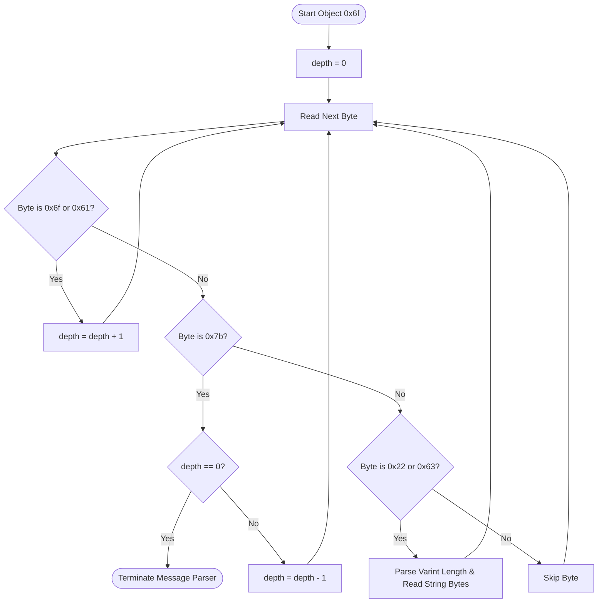

# Unveiling the Hidden Echoes: Zero-Dependency Forensic Reconstruction of "Deleted" LLM Chats from Browser & Desktop LevelDB Instances

**Author:** [Insert Speaker Name]  
**Organization:** [Insert Organization / Independent]  
**Target Venue:** Black Hat India Briefings  
**Category:** AI, ML, & Data Science / Threat Hunting & Incident Response  

---

## Abstract

As Large Language Model (LLM) portals become standard corporate utilities, proprietary source code, credentials, and sensitive configurations are routinely processed by users. When a user clicks "Delete Chat" inside ChatGPT, Claude, or Gemini interfaces, they expect their local trace data to be permanently erased. However, because Chromium-based browsers (Chrome, Edge) and Electron desktop clients store this telemetry inside IndexedDB databases backed by Google's LevelDB engine, these deleted records persist on disk in write-ahead logs (`.log`) and uncompacted Sorted String Tables (`.sst`/`.ldb`). 

This paper details the reverse engineering of client-side LLM storage schemas and the V8 deserialization format. We present the mechanics of rebuilding conversation trees directly from raw binary fragments. Finally, we introduce a zero-dependency, pure-Python carving methodology to bypass active database locks and dynamically reconstruct deleted chat histories across all user profiles, providing incident responders with a secure, cryptographically validated chain of custody.

---

## 1. Introduction: The Ephemeral AI Fallacy

The security industry has focused heavily on Generative AI security at the boundary layer: prompt injections, data guardrails, and cloud storage compliance. Virtually unmapped, however, is the client-side forensic footprint left behind by web interfaces and native wrapper applications. 

When a user deletes a chat thread, the cloud-side storage is updated. Locally on the endpoint, however, the deletion is simply written as a LevelDB tombtone or index update. Because LevelDB is an append-only log-structured merge-tree (LSM tree), the actual serialized data blocks containing the prompts and responses remain intact in write-ahead log records or orphaned data blocks until compaction occurs—a process that can take hours, days, or never happen if the database size is small. This creates a critical forensic window: an attacker or examiner with local access can recover sensitive, supposedly "deleted" data.

---

## 2. Low-Level Database Architecture: IndexedDB & LevelDB

Chromium browsers implement IndexedDB using LevelDB as the underlying storage engine. On Windows, these files reside in user AppData folders:
`%LOCALAPPDATA%\Google\Chrome\User Data\<ProfileName>\IndexedDB\https_chatgpt.com_0.indexeddb.leveldb\`

A LevelDB database directory consists of:
*   **Write-Ahead Log (`.log`):** Active writes are written sequentially here before being flushed to memtables.
*   **Sorted String Tables (`.sst`/`.ldb`):** Organized in levels (0 to 6), these files store key-value pairs sorted alphabetically and compressed with Snappy.
*   **MANIFEST:** Records the state of the database, matching SSTables to their respective levels.
*   **LOCK:** Binds the database to a single active process, preventing other standard leveldb drivers from accessing the directories.

Traditional forensics tools rely on loading LevelDB using compiled C++ drivers (like `plyvel`). During a live incident response triage, installing compiler tools on production machines is prohibited. Incident responders require a zero-dependency byte carver that directly dissects raw files.

---

## 3. Reversing V8 Serialization: The Binary Structure

Chrome and Edge store IndexedDB records serialized in V8's internal binary serialization format (`ValueSerializer`). 

### 3.1. Varint Decoding
V8 uses Google Protocol Buffer style varints (variable-length integers) to encode lengths and indexes. Every byte’s highest-order bit (bit 7) is a flag:
*   `1` means another byte follows.
*   `0` indicates the end of the varint.

The lower 7 bits of each byte are concatenated to form the integer value.

### 3.2. V8 String Tags and UTF-16LE Encoding
Strings in the serialized format are prefixed with data type tags:
*   **OneByteString (`0x22`):** ASCII string. Followed by a varint representing character length (and byte length), followed by raw string bytes.
*   **TwoByteString (`0x63`):** UTF-16LE string. Crucially, **the varint length represents the number of bytes**, not characters. The string is decoded by reading exactly `length` bytes and translating them using `utf-16le`. Failing to parse `0x63` correctly causes the parser to overshoot the end of the string, corrupting subsequent message properties.

### 3.3. Key-Value Padding
In raw IndexedDB logs, key-value boundaries are often padded with `0x00` bytes. A robust carver must check for and skip all leading `0x00` padding bytes before attempting to read a property value tag (such as `0x22` or `0x63`).

---

## 4. Message Reassembly & Role Reconstruction

To map raw strings into chronological conversations, we reverse-engineered the serialization structure of the `messages` array.

### 4.1. Smi-Shifted Index Keys
V8 serializes array element properties using small integers (Smi) as keys. V8 encodes Smis by shifting the integer left by 1 bit (`encoded = actual << 1`). 
When parsing, the index key read by `read_varint` (e.g. `2`, `4`, `6`, `8`) represents the actual array indices (`1`, `2`, `3`, `4`). 

The actual message index indicates the role:
*   **User Prompts:** Odd actual indices (e.g., `actual_idx = 1`, Smi-shifted index `2`).
*   **Assistant Responses:** Even actual indices (e.g., `actual_idx = 2`, Smi-shifted index `4`).

The role mapping is mathematically defined as:
$$\text{role} = \begin{cases} 
\text{"user"} & \text{if } (\text{index} \mathbin{/} 2) \bmod 2 = 1 \\
\text{"assistant"} & \text{if } (\text{index} \mathbin{/} 2) \bmod 2 = 0 
\end{cases}$$

### 4.2. Nesting Depth Tracking
V8 serialized message objects contain nested objects (like `author` and `content`). Because object ends are marked by `0x7b` (`'}'`), a simple parser would break out of the message parsing loop prematurely upon encountering the first inner property end tag. 

A forensic-grade parser must track nesting depth:
1.  Initialize `depth = 0`.
2.  Increment `depth` on object (`0x6f`) or array (`0x61`) tags.
3.  Decrement `depth` on object end (`0x7b`).
4.  Only terminate the message property loop when `depth == 0` and a trailing `0x7b` is read.

---

## 5. Bypassing Exclusive Access: Live Multi-Profile Carving

### 5.1. Dynamic Profile Discovery
Active forensic targets do not always run under browser "Default" profiles. Users often run isolated sessions on secondary profiles (`Profile 1`, `Profile 3`, etc.). The forensic framework dynamically walks the User Data base paths, detects all `Default` and `Profile *` directories, and monitors their respective IndexedDB LevelDB instances simultaneously.

### 5.2. File Lock Bypass
Windows places exclusive write locks on active LevelDB log files. Because the OS allows read sharing on write-ahead logs, the framework accesses the files in read-only binary mode (`'rb'`). It copies the active `.log` bytes to a temporary directory in memory or workspace folders, parsing them without interfering with the user's active browser session or causing database corruption.

---

## 6. Chain of Custody & Forensic Presentation

To present carved chat histories in a legally sound manner, the acquisition framework implements:
1.  **HMAC-SHA256 Integrity Seals:** The carved payload dictionary is serialized canonically and signed with a dynamic session key:
    $$\text{signature} = \text{HMAC-SHA256}(\text{SessionKey}, \text{CanonicalJSON}(\text{payload}))$$
2.  **In-Browser Integrity Check:** The dashboard UI uses the Web Cryptography API (`window.crypto.subtle.verify`) to validate the evidence envelope's integrity before displaying it, proving that the evidence has not been tampered with post-acquisition.
3.  **Refreshed Tab State Persistence:** The UI maintains the active thread tab context across periodic refreshes using state variables, enabling clean forensic presentations during live briefings.

---

## 7. Mitigations

To prevent local AI telemetry leakage:
*   Configure corporate browsers to register clean-up policies for local databases and IndexedDB cache files on exit.
*   Enforce local disk encryption (BitLocker, FileVault) to prevent offline extraction of LevelDB databases.
*   Implement Endpoint Detection and Response (EDR) rules to monitor unusual accesses to Chromium profile paths.

---

## 8. Conclusion

This paper demonstrates that the "ephemeral" nature of deleted web and desktop AI sessions is a myth. By parsing raw V8 serialized objects from write-ahead logs and SSTables, investigators can fully recover deleted chat records. The zero-dependency, multi-profile python carving approach presented in **Verity** provides incident responders with a lightweight and cryptographically secure tool to investigate insider leaks and endpoint compromise.
